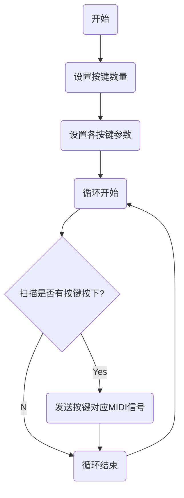

让github-pages支持latex数学公式和画图

[toc]

### 几个数学公式和画图的效果展示
#### 一些数学公式显示例子

符号|读音|意义
|---|---|---|
$\forall$|forall、any|任意给定的
$\exists$|exists|存在
$\sum$|sum、sigma|求和、连加
$\prod$|prod、pi|求积、连剩
Q|Q|有理数
$Q^c$||无理数

德摩根律： $\overline{A\cap B}=\overline A\cup \overline B$,$\overline{A\cup B}=\overline A\cap \overline B$

$$
E^{(r)}_{m\times n}=
\left(
\begin{matrix}
E_r&O\\
O&O
\end{matrix}
\right)
$$

$$
A_{m\times n}\xrightarrow[行变换]{初等}行阶梯形矩阵\xrightarrow[行变换]{初等}行最简形矩阵\xrightarrow[列变换]{初等}等价标准形矩阵E^{(r)}_{m\times n}
$$

#### 画流程图

+ 有道云笔记语法(不支持)

```
graph TB
start(开始)-->setKeyNums(设置按键数量)
setKeyNums-->setKey(设置各按键参数)
setKey-->loopStart(循环开始)
loopStart-->readPin{扫描是否有按键按下?}
readPin--Yes-->playMidi(发送按键对应MIDI信号)
readPin--No-->loopEnd(循环结束)
playMidi-->loopEnd
loopEnd-->loopStart

```

+ typora使用的mermaid语法(支持)



### 配置步骤
#### 创建一个github pages仓库A并发布
+ 请参考官方说明文档
+ 英文：https://docs.github.com/en/pages/quickstart
+ 中文：https://docs.github.com/cn/pages/quickstart

#### 修改_config.yml文件，加入如下内容
```
markdown: kramdown
kramdown:
  math_engine: katex
```

#### 在根目录下创建_includes/header.html文件,并在文件中加入如下代码
```
<head>
	<script type="text/x-mathjax-config"> 
   		MathJax.Hub.Config({ TeX: { equationNumbers: { autoNumber: "all" } } }); 
   	</script>
    <script type="text/x-mathjax-config">
    	MathJax.Hub.Config({tex2jax: {
             inlineMath: [ ['$','$'], ["\\(","\\)"] ],
             processEscapes: true
           }
         });
    </script>
    
    <script src="https://cdn.mathjax.org/mathjax/latest/MathJax.js?config=TeX-AMS-MML_HTMLorMML" type="text/javascript">
    </script>
	
	
    	<script src="//cdnjs.cloudflare.com/ajax/libs/mermaid/8.6.0/mermaid.min.js"></script>
	<script>
		var config = {
		  startOnLoad: true,
		  theme: "forest",
		  flowchart:{
		    useMaxWidth: true,
		    htmlLabels: true
		  }
		};
		mermaid.initialize(config);
		window.mermaid.init(undefined, document.querySelectorAll('.language-mermaid'));
	</script>
</head>
```
#### 在根目录下创建_layouts/default.html文件，并在文件中加入如下代码
```
<!DOCTYPE html>
<html lang="en">
\{\% include header.html \%\}

<style>
.center {
  margin: auto;
  width: 50%;
  border: 1px solid #F5F5F5;
  padding: 10px;
}
</style>
</head>

<body>	
<div class="center">
    \{\{ content \}\}	

</div>
</body>

<script>
var config = {
    startOnLoad:true,
    flowchart:{
            useMaxWidth:true,
            htmlLabels:true
        }
};
mermaid.initialize(config);
window.mermaid.init(undefined, document.querySelectorAll('.language-mermaid'));
</script>

</html>
```

#### 编辑markdown文档，就可以使用mermaid语法画图，使用latex语法写数学公式

### 遗留问题
+ 启用_layouts/default.html模板文件后，丢失了原来自带的样式，得自己写css控制样式，我又不会前端，所以你们看到的这个文章很难看。

### 下面是在学习这个知识中参考过的一些网页

+ http://leohope.com/%E8%A7%A3%E9%97%AE%E9%A2%98/2017/09/08/page-with-latex/

+ https://lloyar.github.io/2018/10/08/mathjax-in-jekyll.html

+ 在GitHub上创建和托管个人网站(下)：https://blog.csdn.net/qq_26927285/article/details/78762237


+ jekyll的目录结构：https://jekyllrb.com/docs/structure/


+ jekyll文档:
http://jekyllcn.com/docs/templates/

+ Github Pages + jekyll 全面介绍极简搭建个人网站和博客： https://zhuanlan.zhihu.com/p/51240503

#### 用 GitHub 搭建静态博客太繁琐？用这个小工具实现「傻瓜式」发布
+ https://sspai.com/post/58013#!

+ 该网页介绍了一些其它网页没有介绍的github-pages特点，如下面这段

	目前，GitHub 上的所有仓库都可以开启 Pages 服务。仓库分为两类：

	第一类，仓库名形如 <用户名>.github.io。开启 Pages 服务后可以直接通过 http://<用户名>.github.io 访问。
	
	第二类，其它名称的仓库。对这些仓库，开启 Pages 服务后可以通过 http://<用户名>.github.io/<仓库名> 访问。
	
	两类仓库都可以指定部署的内容来源，包括：
	
	master 分支（默认）  
	master 分支中的 docs 文件夹  
	gh-pages 分支  
	这两类仓库都可以绑定自定义域名，方法相同，在发布来源中创建 CNAME 文件或者在设置中绑定就行。此外，私有仓库也可以开启 Pages 服务，这十分适合用来发布博客，设想在 master 分支中存储源文件，是只自己可见的；将生成的网站发布到 gh-pages 分支，是公众可见的。这是兼具安全与便捷性的方案。
